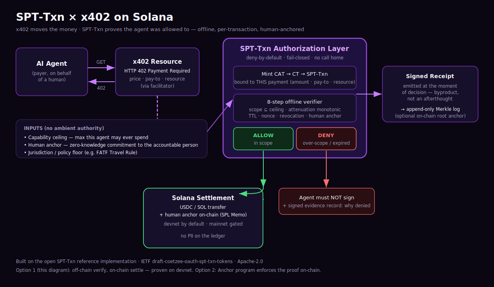

# Architecture

## The gap SPT-Txn fills

x402 is a payment protocol. A client requests a resource, the server answers
**HTTP 402 Payment Required** with a price, a pay-to address, and the resource
context; the client pays (USDC/SOL on Solana), attaches proof, and retries; a
**facilitator** verifies and settles the payment on-chain.

x402 answers exactly one question: **"did the money move?"** It says nothing
about:

- **Authorization** — was this agent allowed to make *this* payment?
- **Delegation** — an agent hands work to a sub-agent; who bounded that sub-agent?
- **Accountability** — which human is on the hook for this payment?
- **Policy** — does this cross a regulated boundary (Travel Rule, sanctions, DORA)?
- **Revocation** — the human said stop 200ms ago; does the token still work?

This is the confused-deputy / goal-hijacking surface (OWASP Agentic **ASI01**). A
compromised or prompt-injected agent with a funded wallet and no authorization
layer will pay whatever it is manipulated into paying. **SPT-Txn is that missing
layer.**

## The flow (Option 1 — off-chain verify, on-chain settle)

1. **Agent → x402 resource.** The agent requests a resource and receives a `402`
   with the payment requirement (price, pay-to, resource id).

2. **Gate: mint bound to THIS payment.** Before signing anything, the SPT-Txn gate
   (`gate/`) mints a `CAT → CT → SPT-Txn` chain whose intent digest is bound to
   the exact payment — amount, pay-to, resource — and to the agent's capability
   ceiling and the accountable human's zero-knowledge anchor. Scope is enforced
   **at mint**: a payment outside the ceiling cannot be minted.

3. **Verify offline.** The 8-step verifier checks the whole chain with no network
   call: scope ⊆ ceiling, delegation attenuation is monotonic, TTL/nonce valid,
   not revoked, the human anchor and context hash bind. Fail-closed: any failure
   or unavailability → **DENY** with a distinguishable evidence class (violation
   vs. outage).

4a. **DENY** → the agent must not sign. A signed evidence record explains why.

4b. **ALLOW** → the settler (`settle/`) submits the Solana transfer (USDC/SOL) and
    writes the **human anchor on-chain via the SPL Memo program** — visible to any
    explorer/indexer, with **no PII on the ledger**. Devnet by default; mainnet
    gated behind explicit confirmation.

5. **Receipt.** A signed receipt is emitted at the moment of decision and appended
   to a Merkle transparency log. Optionally, the log's root is anchored on-chain —
   giving an on-chain, tamper-evident trail **without** putting verification
   on-chain.

## Why off-chain verification (and not on-chain first)

The product thesis is **offline, no-call-home, sub-millisecond** authorization.
Putting the verifier on-chain (Option 2) contradicts that for the core path: it
adds compute cost, latency, and — critically — a *second* canonicalization
implementation in a second language, which is the #1 authorization-bypass bug
class in this design (issuer and verifier canonicalizing a request differently).

So the sequencing is deliberate:

- **Option 1 (this diagram)** — off-chain verify, on-chain settle. Fast, reliable,
  true to the pitch, and **already proven on devnet.**
- **Option 2** — an Anchor (Rust) program that verifies the SPT-Txn proof
  on-chain before releasing escrowed payment, using Solana's Ed25519 precompile.
  Stronger "trustless" story; higher build and audit cost. Built *after* Option 1
  works. Online-verification is a real market trend, so this is on the near path,
  not the backlog.

## Trust boundary & isolation

- The offline authorization engine (gate + verifier) never imports a chain SDK.
- The Solana SDK lives only in `settle/` (its own Go module), so chain code cannot
  reach into the decision path.
- Keys are env-only (`SOL_OPERATOR_KEY`); no key material in the repo.
- No custom cryptography anywhere — Ed25519, Solana's Ed25519 precompile, SPL Memo.
